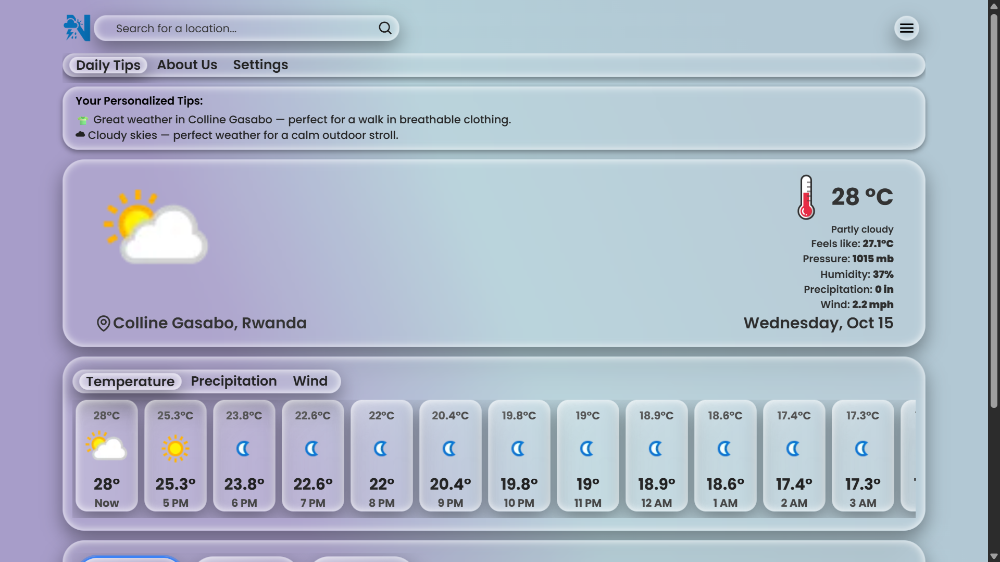
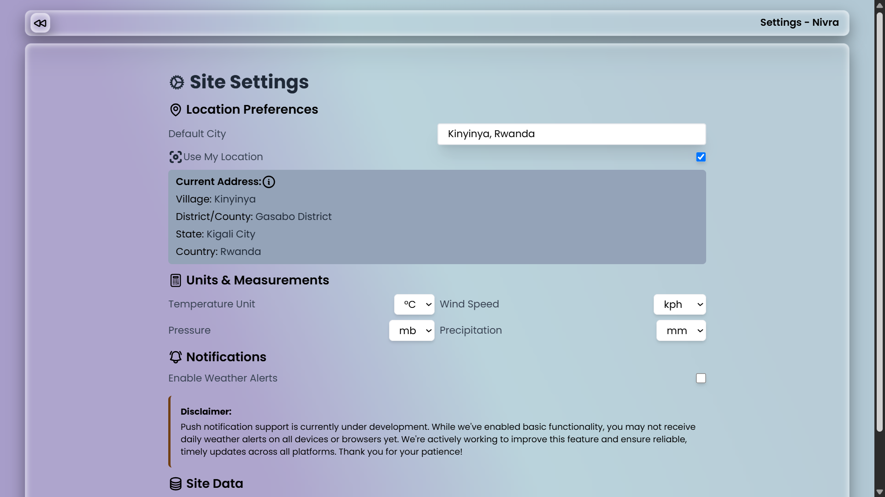

# Weather Forecast App 🌦️

## Overview

This is a **Weather Forecast Web Application** built with **React**.  
The main inspiration came from a common daily problem - not knowing what clothes to wear based on the weather.  
So I decided to create an app that not only shows weather updates but also gives clothing suggestions according to the current conditions. 👕🧥🌞🌧️

## ✨ Features

- 🌍 Real-time weather updates using a weather API
- 👕 Smart clothing suggestions based on temperature and weather type
- 📍 Location-based forecast (using your current location)
- 🌤️ Displays temperature, humidity, wind speed, and weather icons
- 📱 Fully responsive design (works on mobile and desktop)

## Preview

<p>
    
</p>
<p>
    
</p>

## 🧠 Inspiration

There were many times I stood in front of my wardrobe unsure what to wear - raincoat or T-shirt? sweater or shorts?  
That small frustration inspired me to build a **weather + clothing recommendation** app that helps anyone plan their outfit smartly every day.

## ⚙️ Tech Stack

- **Frontend:** React.js (Vite or Create React App)
- **Styling:** Tailwind CSS | CSS Modules
- **API:** Weather API

## 🚀 Getting Started

1. Clone the repository
   ```bash
   git clone https://github.com/yourusername/weather-forecast-app.git
   ```
2. Navigate into the folder
   ```bash
   cd weather-forecast-app
   ```
3. Install dependencies
   ```bash
   npm install
   ```
4. Add your weather API key in `.env` file
   ```env
   VITE_WEATHER_API_KEY=your_api_key_here
   ```
5. Start the development server
   ```bash
   npm run dev
   ```

## 💡 Future Improvements

- Add weekly forecasts
- Improve clothing recommendation logic (consider wind chill, UV index, etc.)
- Add seasonal theme and background change
- Enable saving favorite locations

## 🧑‍💻 Author

**[Ukobizaba Aimable](https://ukobizaba-aimable.vercel.app/)**  
Inspired by the need for smarter daily weather insights and dressing comfort.

---

Made with ❤️ using React.
